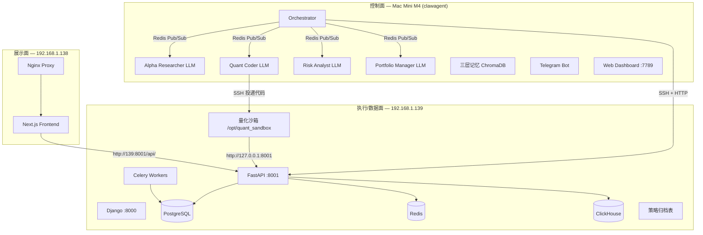
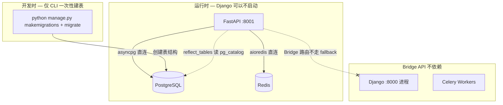
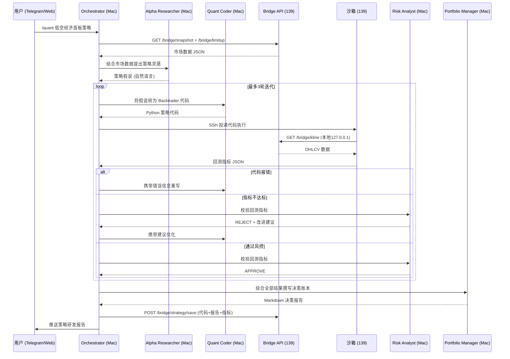

# OpenClaw × ReachRich 数据接入与量化回测集成方案

## 一、系统定位与三端拓扑




## 二、开发框架分工：Bridge API 零 Django 运行时依赖

### 2.1 运行时依赖关系




**关键事实:**

- `metadata.reflect()` 连接的是 PostgreSQL，不是 Django 进程。Django 挂了、关了都不影响 FastAPI 启动。
- 现有 `fallback.py` 把 FastAPI 未实现的端点代理到 Django:8000。但 Bridge API 的所有端点在 FastAPI 中完整实现，**不会走 fallback 代理**。
- 回测执行器用 `subprocess` 直接运行，**不依赖 Celery worker**。
- 结论: **Django 进程 (port 8000) 完全关停的情况下，Bridge API 全部端点正常工作。**

### 2.2 Django 仅做一次性 Schema 建表 (开发时 CLI)

Django 的参与仅限于开发阶段的 CLI 命令，不是运行时依赖:

```bash
# 一次性操作，完成后 Django 进程是否运行不影响 Bridge API
python manage.py makemigrations stocks
python manage.py migrate
```

如果未来需要彻底去掉 Django CLI 依赖，可选方案: 在 FastAPI 侧引入 Alembic 管理 Bridge 相关表的 migration (独立于 Django migration 体系)。当前阶段不必要，因为 **Django CLI ≠ Django 运行时**。

### 2.3 FastAPI 启动自检 — 缺表时明确报错

```python
REQUIRED_BRIDGE_TABLES = [
    'stocks_aistrategyledger', 'stocks_bridgeauditlog',
    'stocks_marketdata', 'stocks_limitlistdata',
]

async def reflect_tables() -> None:
    sync_engine = create_engine(settings.DATABASE_URL_SYNC, pool_pre_ping=True)
    metadata.reflect(bind=sync_engine)
    sync_engine.dispose()
    missing = [t for t in REQUIRED_BRIDGE_TABLES if t not in metadata.tables]
    if missing:
        logger.error("Bridge required tables missing: %s — "
                     "Run: python manage.py makemigrations && migrate", missing)
```

### 2.4 FastAPI 数据操作模式 (沿用项目已有模式, 不经过 Django)

```python
# 读取: asyncpg 直连 PostgreSQL
rows = await db.execute(text("SELECT * FROM stocks_aistrategyledger WHERE ..."), params)
# 写入: 同样直连, 不经过 Django ORM
await db.execute(text("INSERT INTO stocks_aistrategyledger (...) VALUES (...)"), data)
await db.commit()
```

## 三、核心接入模块：Data Bridge API

在 ReachRich FastAPI 后端新增 `fastapi_backend/api/openclaw_bridge.py`，提供 OpenClaw 专用的数据接口。

### 3.1 端点设计

**基础行情 (Market Agent 消费)**

- `GET /api/bridge/kline/` — K线数据 (ts_code, period=daily/weekly/monthly, start_date, end_date, limit)
  - 返回: OHLCV + pct_chg + vol + amount，JSON 数组
  - 数据源: `stocks_marketdata` / `stocks_weeklydata` / `stocks_monthlydata`
- `GET /api/bridge/snapshot/` — 全市场最新快照
  - 返回: 涨停数、跌停数、涨跌比、成交量、北向资金、市场情绪指数
  - 数据源: 聚合 `stocks_marketdata` + `stocks_marketfundflow` + `stocks_marketsentiment`
- `GET /api/bridge/limitup/` — 涨停板聚合数据
  - 返回: 涨停/跌停/炸板列表 + 连板梯队 + 行业分布统计
  - 数据源: `stocks_limitlistdata`

**深度数据 (Analysis/Strategist Agent 消费)**

- `GET /api/bridge/concepts/` — 概念板块聚合 (含成分股、涨跌幅、资金流)
  - 数据源: `stocks_conceptboard` + `stocks_stockconceptrelation`
- `GET /api/bridge/dragon-tiger/` — 龙虎榜聚合 (含机构/游资关联)
  - 数据源: `stocks_dragontiger` + `stocks_dragontigerinst` + `stocks_hotmoney`
- `GET /api/bridge/sentiment/` — 舆情摘要 (热词、关联股、情绪分布)
  - 数据源: `stocks_sentimentnews` + `stocks_sentimentstats`
- `GET /api/bridge/indicators/` — 技术指标 (MA/MACD/KDJ/RSI/BOLL)
  - 数据源: `stocks_stockindicator`

**策略相关 (Quant Pipeline 消费)**

- `GET /api/bridge/presets/` — 已有策略预设列表 (含 DSL payload)
  - 数据源: `stocks_strategypreset` + `stocks/strategy_presets/*.json`
- `POST /api/bridge/screener/` — 执行 DSL 选股
  - 复用现有 `_run_screener` 逻辑
- `POST /api/bridge/backtest/run/` — 执行回测 (接收 Python 代码或 DSL)
  - 沙箱模式: 在 `/opt/quant_sandbox` 执行
  - DSL 模式: 复用现有 screener + 历史回溯
- `POST /api/bridge/strategy/save/` — 保存 AI 生成的策略到归档
- `GET /api/bridge/ledger/` — 决策账本列表
- `GET /api/bridge/ledger/{id}/` — 决策账本详情

### 3.2 认证与安全方案 (三重防护)

**第一层: IP 白名单中间件**

在 `fastapi_backend/middleware/` 新增 `bridge_guard.py`，所有 `/api/bridge/` 路径仅允许 Mac Mini IP 访问：

```python
BRIDGE_ALLOWED_IPS = {"192.168.1.xxx"}  # Mac Mini 内网IP (从环境变量读取)

class BridgeGuardMiddleware(BaseHTTPMiddleware):
    async def dispatch(self, request, call_next):
        if request.url.path.startswith("/api/bridge/"):
            client_ip = request.client.host
            if client_ip not in BRIDGE_ALLOWED_IPS:
                return Response(status_code=403, content='{"detail":"Forbidden"}')
            # 独立限流: bridge 端点 30 req/min (防止 LLM 异常循环)
            ...
        return await call_next(request)
```

**第二层: API Key 签名认证**

- Header: `X-Bridge-Key: <HMAC-SHA256(timestamp + path, secret)>`
- Header: `X-Bridge-Timestamp: <unix_ts>` (5分钟窗口防重放)
- Secret 存储在 139 服务器环境变量 `BRIDGE_SECRET`，Mac 侧同步配置
- 非 JWT —— 无需用户登录，适合机器间通信

**第三层: 只读/写入分离**

- GET 端点 (kline/snapshot/limitup 等): 只需 API Key
- POST 端点 (backtest/save/screener): 需 API Key + 额外的 `X-Bridge-Nonce` 防重放
- 写入操作强制审计日志 (写入 `stocks_bridge_audit_log` 表)

## 四、回测沙箱部署 (139 服务器)

### 4.1 沙箱环境

```bash
# 路径: /opt/quant_sandbox
# 用户: quant_runner (低权限)
# Python: 独立 venv，不污染业务环境
# 依赖: backtrader, pandas, numpy, pandas_ta, vectorbt, requests, pyarrow
```

### 4.2 数据获取约束

Quant Coder 生成的代码**必须**通过本地 API 获取数据：

```python
# 强制约束: 只能使用 127.0.0.1:8001 的 bridge API
url = "http://127.0.0.1:8001/api/bridge/kline/"
params = {"ts_code": args.stock, "start_date": args.start, "end_date": args.end}
df = pd.DataFrame(requests.get(url, headers={"X-Bridge-Key": KEY}).json()["data"])
```

### 4.3 沙箱安全体系 (五层防护)

**L1: 操作系统级隔离**

- 沙箱用户 `quant_runner` 无 sudo 权限
- 仅可访问 `/opt/quant_sandbox/` 目录，无法读取 `/data/jupyter/` 业务代码
- SSH 登录仅允许 Mac Mini 公钥 (禁止密码登录)
- `quant_runner` 的 `.ssh/authorized_keys` 设置 `command=` 限制只能执行特定脚本

**L2: 代码静态扫描 (执行前)**

```python
BANNED_IMPORTS = {'os', 'sys', 'subprocess', 'shutil', 'socket', 'http',
                  'urllib', 'pathlib', 'importlib', 'ctypes', 'signal'}
BANNED_PATTERNS = [r'while\s+True', r'__import__', r'eval\s*\(', r'exec\s*\(',
                   r'open\s*\(.*["\']w', r'open\s*\(.*["\']a']

def validate_code(code: str) -> tuple[bool, str]:
    """返回 (is_safe, reason)。扫描导入白名单和危险模式。"""
```

**L3: 进程级隔离 (执行时)**

- `subprocess.run()` + `timeout 600` 硬超时
- 通过 `ulimit` 限制内存 (`-v 2097152` = 2GB) 和文件描述符 (`-n 64`)
- 禁止网络访问: 沙箱执行前设置 `unshare --net` 或 iptables 规则仅放行 `127.0.0.1:8001`

**L4: 输出校验 (执行后)**

- 输出必须为最后一行纯 JSON: `{"cagr": ..., "max_drawdown": ..., "win_rate": ..., "trades": ...}`
- JSON 中数值字段强制范围校验: cagr `[-1, 100]`, max_drawdown `[-1, 0]`, win_rate `[0, 1]`
- 非法输出视为回测失败，不入库

**L5: 文件生命周期管理**

- 每次回测完成后自动清理 `temp_strategy.py`
- `/opt/quant_sandbox/` 设置定时清理 cron (每小时清理超过 1 小时的临时文件)
- 回测日志保留 7 天后自动归档

## 五、量化 Pipeline 数据流




## 六、数据模型扩展 (仅 Django Model 定义 + migrate)

在 ReachRich 中新增 Django Model 存储 AI 策略归档：

**文件**: `stocks/models/ai_strategy.py`

```python
class AIStrategyLedger(models.Model):
    title = models.CharField(max_length=200)
    topic = models.CharField(max_length=200)
    status = models.CharField(max_length=20)  # APPROVE / REJECT / PENDING / TAMPERED
    attempts = models.IntegerField(default=1)
    strategy_code = models.TextField(blank=True)
    code_hash = models.CharField(max_length=64, blank=True, db_index=True)
    backtest_metrics = models.JSONField(default=dict)
    risk_review = models.TextField(blank=True)
    decision_report = models.TextField(blank=True)  # Markdown
    report_hash = models.CharField(max_length=64, blank=True)
    model_used = models.CharField(max_length=100, blank=True)
    source_ip = models.GenericIPAddressField(null=True, blank=True)
    is_immutable = models.BooleanField(default=False)
    created_at = models.DateTimeField(auto_now_add=True)

    class Meta:
        app_label = 'stocks'
        ordering = ['-created_at']

    def save(self, **kwargs):
        import hashlib
        if self.is_immutable and self.pk:
            raise ValueError("Immutable record cannot be modified")
        if self.strategy_code:
            self.code_hash = hashlib.sha256(self.strategy_code.encode()).hexdigest()
        if self.decision_report:
            self.report_hash = hashlib.sha256(self.decision_report.encode()).hexdigest()
        super().save(**kwargs)

    def verify_integrity(self) -> bool:
        import hashlib
        code_ok = not self.strategy_code or hashlib.sha256(self.strategy_code.encode()).hexdigest() == self.code_hash
        report_ok = not self.decision_report or hashlib.sha256(self.decision_report.encode()).hexdigest() == self.report_hash
        return code_ok and report_ok
```

## 七、OpenClaw 侧改造要点

### 7.1 Market Agent 数据源更新

将 `data_sources/source_router.py` 的主 API 地址从 `192.168.1.138/api/` 改为 `192.168.1.139:8001/api/bridge/`，利用 Bridge API 的结构化输出：

- `get_limitup` → `GET /bridge/limitup/`
- `get_summary` → `GET /bridge/snapshot/`
- `get_concepts` → `GET /bridge/concepts/`
- `get_hot` → `GET /bridge/snapshot/` (含热股字段)

### 7.2 BacktestAgent 改造

- SSH 目标: `quant_runner@192.168.1.139`
- 远程 Python: `/opt/quant_sandbox/venv/bin/python`
- 代码投递: SSH `cat >` 方式写入临时文件
- 执行: `timeout 600` 限制
- 结果: 解析 stdout 最后一行 JSON

### 7.3 Quant Coder System Prompt 约束

```yaml
quant_coder:
  llm: "qwen2.5-coder:14b"  # 或 deepseek-coder
  system_prompt: |
    你是量化 Python 工程师。代码在 192.168.1.139 本地执行。
    【数据获取】必须使用: http://127.0.0.1:8001/api/bridge/kline/
    【参数解析】必须包含 argparse: --stock, --start, --end
    【输出格式】最后一行 print JSON:
      {"cagr": 0.15, "max_drawdown": -0.12, "sharpe": 1.2, "win_rate": 0.55, "trades": 42}
    【禁止】yfinance, akshare, os, sys, subprocess, 外部网络
```

## 八、前端展示集成

在 Next.js 前端新增 "AI 策略大厅" 页面：

- **路由**: `/ai-strategies`
- **数据源**: `GET /api/bridge/ledger/` → 策略卡片列表
- **详情页**:
  - 左侧: 渲染决策账本 Markdown (react-markdown)
  - 右侧: ECharts 收益曲线 + 源码高亮
- **触发**: 可选 "重新回测" 按钮 → `POST /api/bridge/backtest/run/`

## 九、数据流可靠性保障

### 9.1 缓存加速

在 Bridge API 中对高频 GET 端点增加 Redis 缓存，避免每次请求都查 PostgreSQL：

- `/bridge/snapshot/` — Redis TTL 30s (实时性要求高)
- `/bridge/limitup/` — Redis TTL 60s (盘中频繁调用)
- `/bridge/kline/` — Redis TTL 300s (历史数据变化少)
- `/bridge/concepts/` — Redis TTL 120s

缓存键规则: `bridge:{endpoint}:{param_hash}`，支持手动 purge。

### 9.2 请求重试与降级

OpenClaw Market Agent 对 Bridge API 调用增加重试逻辑：

- 默认重试 3 次，指数退避 (1s, 2s, 4s)
- 超时设置: GET 10s, POST (回测) 620s
- 全部失败时返回缓存数据 (三层记忆中的最近快照)

### 9.3 数据完整性校验

- Bridge API 所有响应包含 `X-Data-Hash: SHA256(response_body)` Header
- OpenClaw 侧校验 hash 确保传输未被篡改
- 回测结果包含 `code_hash: SHA256(strategy_code)` 用于关联验证

### 9.4 连接池与并发控制

- FastAPI 现有连接池 (pool_size=20, max_overflow=10) 足够支撑 Bridge + 前端并发
- 沙箱回测并发上限 = 2 (防止 CPU/内存争抢影响业务)
- 通过 Redis `SETNX` 实现回测任务锁

## 十、安全审计与代码防篡改

### 10.1 ReachRich 后端代码防篡改

**部署阶段:**

- 代码部署通过 Git pull，每次部署后记录 commit hash 到 `/var/log/reachrich/deploy.log`
- 关键文件 (auth.py, main.py, config.py, openclaw_bridge.py) 计算 SHA256 并写入 Redis `deploy:file_hashes`
- 定时 cron (每 10 分钟) 校验关键文件 hash 是否与 Redis 记录一致，异常时通知 Telegram

**运行时:**

```python
CRITICAL_FILES = [
    'fastapi_backend/auth.py',
    'fastapi_backend/api/openclaw_bridge.py',
    'fastapi_backend/middleware/bridge_guard.py',
    'fastapi_backend/main.py',
]
# 启动时计算 hash → Redis；定时任务 check_file_integrity 每 10 分钟比对
```

### 10.2 前端代码防篡改

**构建阶段:**

- Next.js build 产物 (`_next/static/`) 计算整体 hash，记入 `.build-manifest-hash`
- Nginx 配置 `Content-Security-Policy` 限制脚本来源:
  ```
  Content-Security-Policy: script-src 'self' 'unsafe-eval'; style-src 'self' 'unsafe-inline'
  ```
- 开启 `Subresource Integrity (SRI)` 验证静态资源

**运行时:**

- Nginx 禁止直接访问 `.next/` 目录和源码文件
- 前端打包时注入版本号和 build hash，页面底部展示版本标识
- 前端定时 (每 30 分钟) 对比 `/api/version` 返回的 build hash，不一致时提示用户刷新

### 10.3 AI 策略代码防篡改

- 每条 `AIStrategyLedger` 记录包含 `code_hash` 字段 (策略代码的 SHA256)
- 查询时自动校验 `SHA256(strategy_code) == code_hash`，不一致则标记 `TAMPERED`
- 策略归档后 `strategy_code` 和 `decision_report` 设为不可变 (仅允许追加版本，不允许修改)
- 修改记录写入 `audit_log` 表 (who, when, what, before_hash, after_hash)

### 10.4 数据库安全加固

- PostgreSQL 配置 `pg_hba.conf` 仅允许 localhost 和 Mac Mini IP 连接
- 为 Bridge API 创建专用只读数据库用户 `bridge_reader` (SELECT only)
- 回测结果写入使用另一个用户 `bridge_writer` (仅 INSERT/UPDATE `ai_strategy_ledger`)
- 开启 PostgreSQL `log_statement = 'mod'` 记录所有写操作

### 10.5 审计日志总览

新增 Django Model: `BridgeAuditLog`

```python
class BridgeAuditLog(models.Model):
    timestamp = models.DateTimeField(auto_now_add=True, db_index=True)
    source_ip = models.GenericIPAddressField()
    endpoint = models.CharField(max_length=200)
    method = models.CharField(max_length=10)  # GET/POST
    params_hash = models.CharField(max_length=64)
    response_code = models.IntegerField()
    duration_ms = models.IntegerField()
    user_agent = models.CharField(max_length=200, blank=True)
    
    class Meta:
        app_label = 'stocks'
        indexes = [models.Index(fields=['timestamp', 'endpoint'])]
```

## 十一、实施步骤

**Phase 0: 一次性建表 (仅 Django CLI, 不需要 Django Web 进程运行)**

1. 在 `stocks/models/` 新增 `ai_strategy.py` 定义 `AIStrategyLedger` + `BridgeAuditLog` Model
2. `stocks/models/__init__.py` 中 import 新模型
3. `python manage.py makemigrations stocks && python manage.py migrate` (CLI 命令直连 PG, 不需要 Django :8000)
4. 完成后 Django 进程是否运行不影响 Bridge API — FastAPI 通过 reflect 直读 PostgreSQL 表结构

**Phase 1: FastAPI 安全基础 [FastAPI]**

1. 生成 BRIDGE_SECRET 存入 `.env`
2. 实现 `fastapi_backend/middleware/bridge_guard.py` (IP 白名单 + HMAC 认证)
3. 在 `main.py` 注册 BridgeGuardMiddleware
4. 配置 PG 只读用户 `bridge_reader` + `pg_hba.conf` 收紧

**Phase 2: Bridge API 核心端点 [FastAPI]**

1. 实现 `fastapi_backend/api/openclaw_bridge.py` 全部 GET 端点 (kline/snapshot/limitup/concepts/dragon-tiger/sentiment/indicators/presets)
2. Redis 分级缓存
3. 响应签名 `X-Data-Hash`
4. 在 `main.py` 注册 bridge router

**Phase 3: 回测执行 [FastAPI + 139 OS]**

1. 139 服务器创建 quant_runner 用户 + venv + SSH 免密 + iptables
2. 实现 `POST /api/bridge/backtest/run/` (代码扫描 + subprocess 执行 + 结果校验)
3. 实现 `POST /api/bridge/strategy/save/` + `GET /api/bridge/ledger/`

**Phase 4: OpenClaw Agent 对接 [Mac Mini]**

1. Market Agent 数据源 → Bridge API
2. BacktestAgent SSH 配置 + 重试逻辑
3. Quant Coder prompt 约束

**Phase 5: 流水线与前端 [FastAPI + Next.js]**

1. 整合 Alpha→Coder→Backtest→Risk→PM 流水线
2. AI 策略大厅前端页面
3. 代码防篡改部署 (hash 校验 + CSP + SRI)
4. 端到端联调测试

