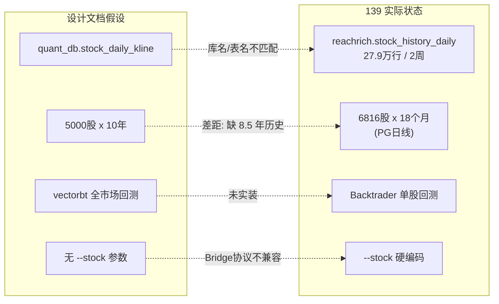
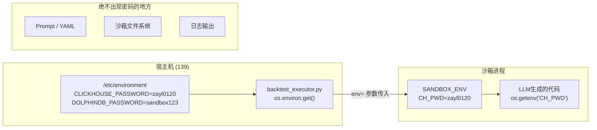
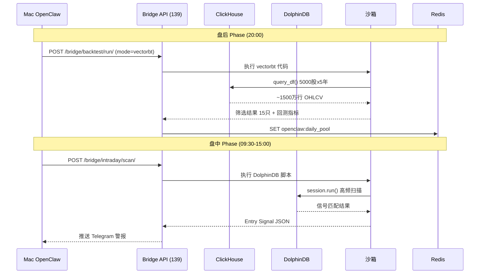
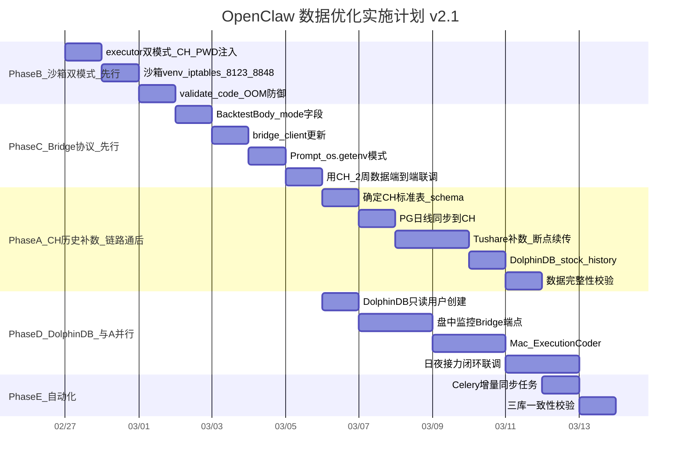

# OpenClaw 数据优化方案 v2.1 — 含安全加固与执行顺序优化

## 零、现状审计摘要（实测数据）

### 数据库实际状态

**PostgreSQL（主存储）**

- `stocks_marketdata`: 214 万行, 6816 只股票, 2024-09-03 ~ 2026-02-26（仅 18 个月日线）
- `stocks_weeklydata`: 333 万行, 1998-09-04 ~ 2026-02-13（28 年周线）

**ClickHouse（`reachrich` 库，非设计文档假设的 `quant_db`）**

- `stock_history_daily`: 27.9 万行, 5478 只股票, 2026-02-11 ~ 2026-02-25（仅 2 周）
- `feature_daily`: 92.7 万行, 6458 只股票, 2026-01-13 ~ 2026-02-25
- `factor_snapshot`: 68.4 万行, 2026-01-13 ~ 2026-02-25
- `daily_kline`: 表存在但 **0 行**
- 认证: user=default, password=zayl0120, HTTP port=8123

**DolphinDB（远超预期的丰富度）**

- `dfs://reachrich/stock_realtime`: **1.17 亿行**
- `dfs://reachrich/realtime/stock_snapshot_rt`: **5974 万行**
- `dfs://reachrich/realtime/realtime_snapshots`: 819 万行
- `dfs://reachrich/stock_history`: **0 行**（但 schema 已含 27 列含技术指标，完全匹配设计需求）
- `dfs://reachrich/stock_snapshot_eod`: 22.5 万行
- 认证: admin/123456, port 8848

### Mac OpenClaw 联动现状

- [bridge_client.py](ReachRich/docs/openclaw/bridge_client.py): `run_backtest(stock=...)` 为**必填**参数
- [backtest_executor.py](ReachRich/fastapi_backend/api/backtest_executor.py) 第 178 行: 硬编码 `--stock {stock} --start {start_date} --end {end_date}`
- [quant_coder_prompt.yaml](ReachRich/docs/openclaw/quant_coder_prompt.yaml): 强制使用 Backtrader + `--stock` 参数
- 沙箱 iptables: 仅放行 `127.0.0.1:8001`，**ClickHouse 8123 端口未放行**
- 回测 timeout=600s（设计文档要求改为 30s，因 vectorbt 秒级完成）

### 设计文档 vs 现实的关键差距




---

## Phase A: ClickHouse 历史数据补全（Phase B+C 链路打通后执行）

**目标**: 从当前 2 周 -> 至少 5 年日线全量（2021-01 ~ 2026-02），覆盖 5000+ 只股票。

**执行顺序说明**: Phase A 排在 B+C 之后。原因: B+C 改造不依赖大量历史数据，可用 CH 现有 2 周数据（27.9 万行）先验证 vectorbt 全链路是否畅通。链路通了再跑漫长的历史补数任务。

### A1: 确定 ClickHouse 标准表

设计文档使用 `quant_db.stock_daily_kline`，但现有库名是 `reachrich`。有两个选择：

- **方案一（推荐）**: 在 `reachrich` 库中复用已存在的 `daily_kline` 空表，补全数据。沙箱代码连接 `reachrich.daily_kline`
- **方案二**: 创建 `quant_db` 库 + `stock_daily_kline` 表，完全匹配设计文档

无论哪种，目标表 schema 统一为：

```sql
-- trade_date Date, ts_code String, open Float64, high Float64, low Float64, 
-- close Float64, vol Float64, amount Float64, pct_chg Float64
```

### A2: 历史数据灌入策略

**数据源优先级：**

1. **PostgreSQL `stocks_weeklydata**`: 28 年周线（1998~2026），可直接导入 CH 作为周级回测支撑
2. **PostgreSQL `stocks_marketdata**`: 18 个月日线，直接同步到 CH
3. **Tushare `daily` API**: 补充 2015-01 ~ 2024-08 的历史日线缺口（约 5000 股 x 2400 交易日 = ~1200 万行）

**实现文件**: `data_factory/tasks/clickhouse_sync.py`（新建）

```python
# 核心任务:
# 1. sync_pg_daily_to_clickhouse() — PG 18个月日线 -> CH daily_kline
# 2. backfill_tushare_to_clickhouse(start="20150101", end="20240831") — Tushare历史补数
# 3. schedule_daily_ch_sync() — 每日盘后增量同步 PG -> CH
```

**预估数据量**: ~1500 万行（5000 股 x 10 年 x ~250 交易日/年 / 多数股票不足 10 年）

### A2.1: Tushare 补数断点续传机制（Patch 3）

Tushare API 限流 200 次/分钟，1200 万行补数任务耗时 2-4 小时，中途因网络波动或限流断开是大概率事件。**禁止写成一个大循环一拉到底**。

**策略**: 按股票代码分块拉取（每块 100 只），每完成一块在 Redis 记录游标。

```python
CURSOR_KEY = "backfill:tushare:cursor"

@app.task(name="data_factory.tasks.clickhouse_sync.backfill_tushare_to_clickhouse",
          bind=True, max_retries=5, default_retry_delay=120)
def backfill_tushare_to_clickhouse(self, start="20150101", end="20240831", batch_size=100):
    import redis
    r = redis.from_url(REDIS_URL)

    all_codes = _get_all_stock_codes()  # 从 PG stocks_stockbasic 获取全量代码
    cursor = int(r.get(CURSOR_KEY) or 0)

    for i in range(cursor, len(all_codes), batch_size):
        batch = all_codes[i : i + batch_size]
        for ts_code in batch:
            df = ts.pro_api().daily(ts_code=ts_code, start_date=start, end_date=end)
            _insert_to_clickhouse(df)  # clickhouse-connect INSERT
            time.sleep(0.35)  # 200次/分 -> 每次 0.3s + buffer

        r.set(CURSOR_KEY, i + batch_size)
        logger.info("Tushare backfill progress: %d / %d", i + batch_size, len(all_codes))

    r.delete(CURSOR_KEY)
    return {"status": "complete", "total_codes": len(all_codes)}
```

**崩溃恢复**: 任务重启后自动从 Redis 游标位置继续，不会重复拉取已完成的股票。

### A3: DolphinDB `stock_history` 同步

DolphinDB 的 `stock_history` 表已有完美 schema（27 列含 MA/MACD/RSI/BOLL 等技术指标）但 0 行。需将 PG + Tushare 历史数据同步灌入。

**实现文件**: `data_factory/tasks/dolphindb_sync.py`（新建或扩展已有）

---

## Phase B: 沙箱双模式回测（首先实施 — 不依赖历史数据）

**目标**: 保留 Backtrader 单股模式，新增 vectorbt 全市场模式。用 CH 现有 2 周数据先验证全链路。

### B1: backtest_executor.py 改造 + 凭据安全注入（Patch 1）

**文件**: [backtest_executor.py](ReachRich/fastapi_backend/api/backtest_executor.py)

关键改动：

- 新增 `mode` 参数: `"backtrader"` (默认) | `"vectorbt"`
- vectorbt 模式移除 `--stock` 参数，改为 `--start` + `--end`
- vectorbt 模式 timeout 降为 60s（设计文档建议 30s，保留安全余量）
- **凭据通过 SANDBOX_ENV 注入，绝不暴露给 LLM 和沙箱文件系统**

```python
# SANDBOX_ENV 扩展（第 32-38 行追加）:
SANDBOX_ENV = {
    "PATH": "/usr/local/bin:/usr/bin:/bin",
    "HOME": SANDBOX_DIR,
    "LANG": "en_US.UTF-8",
    "PYTHONIOENCODING": "utf-8",
    "PYTHONDONTWRITEBYTECODE": "1",
    # Patch 1: 凭据注入 — 密码只存在于进程环境变量中
    "CH_PWD": os.environ.get("CLICKHOUSE_PASSWORD", ""),
    "DOLPHIN_PWD": os.environ.get("DOLPHINDB_PASSWORD", ""),
}

# 第 169-178 行改造后:
if mode == "vectorbt":
    cmd = [
        "sudo", "-u", SANDBOX_USER, "--set-home", "bash", "-c",
        f"ulimit -v 4194304 && ulimit -n 64 && ulimit -t {timeout} && "
        f"timeout {timeout} {SANDBOX_PYTHON} -u {script_path} "
        f"--start {start_date} --end {end_date}"
    ]
else:
    cmd = [  # 原有 backtrader 逻辑
        "sudo", "-u", SANDBOX_USER, "--set-home", "bash", "-c",
        f"ulimit -v 2097152 && ulimit -n 64 && ulimit -t {timeout} && "
        f"timeout {timeout} {SANDBOX_PYTHON} -u {script_path} "
        f"--stock {stock} --start {start_date} --end {end_date}"
    ]
```

**凭据流向（安全链路）:**



### B2: 沙箱环境扩展

```bash
# /opt/quant_sandbox/venv 新增依赖
pip install clickhouse-connect vectorbt dolphindb

# iptables 放行 CH HTTP + DolphinDB
iptables -A OUTPUT -p tcp -d 127.0.0.1 --dport 8123 -m owner --uid-owner quant_runner -j ACCEPT
iptables -A OUTPUT -p tcp -d 127.0.0.1 --dport 8848 -m owner --uid-owner quant_runner -j ACCEPT
```

### B3: 代码静态扫描扩展

`validate_code()` 需要适配 vectorbt 模式：

- 允许 `clickhouse_connect` 导入（仅 vectorbt 模式）
- 禁止 `clickhouse_connect` 写入操作（仅允许 `query_df`）
- 新增 banned pattern: 禁止 `INSERT`, `DROP`, `ALTER` 等 CH/DolphinDB 写操作
- 禁止 `os.getenv` 以外的 `os` 模块方法（白名单放行 `os.getenv`）

```python
# validate_code() 新增检测 (vectorbt 模式):
VBT_BANNED_PATTERNS = [
    re.compile(r"\bINSERT\b", re.IGNORECASE),
    re.compile(r"\bDROP\b", re.IGNORECASE),
    re.compile(r"\bALTER\b", re.IGNORECASE),
    re.compile(r"\bCREATE\b", re.IGNORECASE),
    re.compile(r"\bDELETE\b", re.IGNORECASE),
    re.compile(r"\bdropDatabase\b"),
    re.compile(r"\bdropTable\b"),
    re.compile(r"\bclient\.command\b"),      # CH 写命令
    re.compile(r"\bclient\.insert\b"),       # CH 写入
    re.compile(r"\bclient\.query\b"),        # 仅允许 query_df
]

# os.getenv 白名单: 仅允许 import os 后调用 os.getenv，禁止其他 os 方法
VBT_OS_WHITELIST = re.compile(r"os\.\w+")  # 匹配 os.xxx
VBT_OS_ALLOWED = {"os.getenv", "os.environ.get"}
```

### B4: 全市场 pivot 内存防爆（Patch 2 — OOM 防御）

5000 股 x 2500 天的 pivot 矩阵本身约 300-500MB，但 VectorBT 计算滚动指标（RSI/MACD/BOLL）时会产生大量中间矩阵副本，峰值可达 2-3GB。

**三层防御:**

**L1: ulimit 硬限制** — 已在 B1 中设置 `ulimit -v 4194304` (4GB)，OOM 时进程被 SIGKILL 而非拖垮宿主机。

**L2: Prompt 引导计算下推** — 在 vectorbt_coder Prompt 中教 LLM 把重计算指标预先在 CH 端完成：

```sql
-- 推荐: 让 CH 算好指标，Python 只做信号逻辑
SELECT trade_date, ts_code, close,
       avg(close) OVER (PARTITION BY ts_code ORDER BY trade_date ROWS 19 PRECEDING) AS ma20,
       avg(close) OVER (PARTITION BY ts_code ORDER BY trade_date ROWS 59 PRECEDING) AS ma60
FROM reachrich.daily_kline
WHERE trade_date >= '2021-01-01'
```

```
-- 而不是拉原始 OHLCV 到 Python 再 df.rolling(20).mean()
```

**L3: 超时兜底** — vectorbt 模式 timeout=60s。如果 LLM 写出的策略频繁被 OOM Killed，Orchestrator 应携带错误信息 `"Exit code -9 (OOM): 请将指标计算下推到 ClickHouse SQL 中"` 重新触发 Coder 修正。

---

## Phase C: Bridge API 协议升级 + Mac 客户端同步

**目标**: 回测端点支持双模式，Mac 客户端保持向后兼容。

### C1: Bridge API 回测端点改造

**文件**: [openclaw_bridge.py](ReachRich/fastapi_backend/api/openclaw_bridge.py) 第 552-582 行

```python
class BacktestBody(BaseModel):
    strategy_code: str = Field(..., description="Python 策略代码")
    stock: str = Field("", description="股票代码（backtrader 模式必填）")  # 从必填改可选
    start_date: str = Field("20240101")
    end_date: str = Field("20241231")
    timeout: int = Field(600, ge=30, le=600)
    mode: str = Field("backtrader", pattern="^(backtrader|vectorbt)$")  # 新增
```

向后兼容逻辑：

- `mode=backtrader` + `stock` 非空 -> 走原流程
- `mode=vectorbt` -> `stock` 忽略, timeout 上限 60s, 调用 CH 模式

### C2: Mac bridge_client.py 更新

**文件**: [bridge_client.py](ReachRich/docs/openclaw/bridge_client.py) 第 147-154 行

```python
async def run_backtest(self, code: str, stock: str = "",
                       start_date: str = "20240101", end_date: str = "20241231",
                       timeout: int = 600, mode: str = "backtrader") -> dict:
    body = {
        "strategy_code": code,
        "start_date": start_date, "end_date": end_date,
        "timeout": timeout, "mode": mode,
    }
    if stock:
        body["stock"] = stock
    return await self._post("/backtest/run/", body)
```

### C3: quant_coder_prompt.yaml 双模式 Prompt（Patch 1 应用）

**文件**: [quant_coder_prompt.yaml](ReachRich/docs/openclaw/quant_coder_prompt.yaml)

需新增 `vectorbt_coder` 角色配置。**密码通过 os.getenv 获取，Prompt 中绝不出现明文密码**：

```yaml
vectorbt_coder:
  llm: "qwen2.5-coder:14b"
  temperature: 0.3
  max_tokens: 4096
  system_prompt: |
    你是 OpenClaw 的顶级量化开发工程师。代码在 192.168.1.139 沙箱执行。

    【极其重要 — 数据获取】使用 clickhouse_connect 直连，密码从环境变量读取:
      import os
      import clickhouse_connect
      client = clickhouse_connect.get_client(
          host='127.0.0.1', port=8123, database='reachrich',
          username='default', password=os.getenv('CH_PWD'))

    【推荐 — 指标计算下推给 ClickHouse（Patch 2）】
    当策略需要 MA/RSI/MACD 等滚动指标时，优先在 SQL 中用窗口函数计算：
      df = client.query_df("""
          SELECT trade_date, ts_code, close,
              avg(close) OVER (PARTITION BY ts_code ORDER BY trade_date ROWS 19 PRECEDING) AS ma20
          FROM daily_kline WHERE trade_date >= '{args.start}' AND trade_date <= '{args.end}'
      """)
    这样 Python 端只需处理布尔信号矩阵，内存占用可降低 60-80%。

    【回测框架】必须使用 vectorbt，禁止 Backtrader、循环遍历单股
    【参数解析】argparse: --start, --end (无 --stock)
    【输出格式】最后一行 print JSON:
      {"cagr": 0.15, "max_drawdown": -0.12, "sharpe": 1.2, "win_rate": 0.55, "trades": 42}

    【致命防错规范 — 现代 Pandas 语法】
    1. 严禁 fillna(method='ffill')，必须改用 .ffill() 或 .bfill()
    2. 严禁链式赋值，必须使用 df.loc[] 或 np.where()
    3. NaN 处理: .ffill().fillna(0)

    【禁止】yfinance, akshare, tushare, subprocess, socket, open('w')
    【仅允许的 os 用法】os.getenv('CH_PWD') — 禁止其他 os 方法
```

### C4: 风控阈值调整

vectorbt 全市场模式需更严格的风控（交易样本更多）：

```yaml
vectorbt_risk_thresholds:
  min_sharpe: 0.8      # 从 0.5 提高到 0.8
  max_drawdown: -0.30  # 不变
  min_trades: 30       # 从 5 提高到 30
  min_win_rate: 0.45   # 从 0.35 提高到 0.45
```

---

## Phase D: DolphinDB 盘中流处理接入（可与 Phase A 并行）

DolphinDB 实际状态远超预期（1.17 亿行实时数据），Phase D 可与 Phase A 并行推进。

### D0: DolphinDB 权限隔离（Patch 4 — 前置必做）

沙箱使用 admin 账号连 DolphinDB 极其危险 — 一行恶意代码 `dropDatabase` 即可删除 1.17 亿行心血数据。**必须在 D1 之前完成只读用户创建**。

在 DolphinDB GUI 或 Python 客户端执行：

```python
import dolphindb as ddb
s = ddb.session()
s.connect("127.0.0.1", 8848, "admin", "123456")

# 创建沙箱专用只读用户
s.run("""
    createUser(`quant_sandbox, `sandbox123);
    grant(`quant_sandbox, TABLE_READ, "dfs://reachrich/*");
    grant(`quant_sandbox, TABLE_READ, "dfs://reachrich/realtime/*");
    grant(`quant_sandbox, TABLE_READ, "dfs://concept_realtime/*");
    grant(`quant_sandbox, DB_READ, "dfs://reachrich");
    grant(`quant_sandbox, DB_READ, "dfs://reachrich/realtime");
    grant(`quant_sandbox, DB_READ, "dfs://concept_realtime");
""")
# 验证: 用 quant_sandbox 登录后尝试写操作应被拒绝
```

将 `DOLPHINDB_PASSWORD=sandbox123` 写入 `/etc/environment`，由 `backtest_executor.py` 通过 `SANDBOX_ENV["DOLPHIN_PWD"]` 注入沙箱进程。

### D1: 沙箱 DolphinDB 访问

```bash
# 已在 Phase B2 中完成:
# pip install dolphindb (B2)
# iptables 放行 8848 (B2)
```

### D2: Bridge API 新增盘中监控端点

**文件**: [openclaw_bridge.py](ReachRich/fastapi_backend/api/openclaw_bridge.py)

```python
# POST /api/bridge/intraday/scan/
# 接收 DolphinDB 脚本代码 + 目标股票池
# 在沙箱中执行（以 quant_sandbox 只读用户连接），返回信号 JSON

class IntradayScanBody(BaseModel):
    strategy_code: str = Field(..., description="DolphinDB 扫描 Python 代码")
    stock_pool: list[str] = Field(default_factory=list, description="目标股票池")
    timeout: int = Field(30, ge=10, le=60)
```

### D3: Mac 新增 Execution Coder 角色

新增 `intraday_pipeline.py`，实现"盘后 CH 选股 -> Redis 存池 -> 盘中 DolphinDB 监控"闭环。

Execution Coder Prompt 中使用环境变量连接（同 Patch 1 模式）：

```python
# LLM 生成的代码模板:
import os, dolphindb as ddb
s = ddb.session()
s.connect("127.0.0.1", 8848, "quant_sandbox", os.getenv("DOLPHIN_PWD"))
# 仅有 TABLE_READ 权限，任何写操作都会被 DolphinDB 拒绝
```

### D4: 数据联动架构




---

## Phase E: 增量同步自动化

### E1: Celery 定时任务

**文件**: [data_factory/celery_app.py](ReachRich/data_factory/celery_app.py)

新增 Beat 调度：

- `ch-daily-sync` (16:45): PG 日线 -> CH `daily_kline` 增量同步
- `dolphin-history-sync` (17:00): PG 日线 -> DolphinDB `stock_history` 增量同步
- `ch-feature-sync` (19:45): 因子快照 -> CH `feature_daily` 增量同步

### E2: 数据一致性校验

每日 22:00 自动比对 PG / CH / DolphinDB 三库行数是否一致，差异超 1% 触发告警。

---

## 实施优先级与时间线

**核心原则**: B+C 先行（验证全链路），A 后行（历史补数），D 并行。



---

## 安全加固补丁总表

以下 4 个补丁已分别整合到对应 Phase 中，此处汇总便于实施时逐项核查：

### Patch 1: 凭据安全注入（已整合到 Phase B1 + C3）

- **问题**: LLM Prompt 中硬编码 CH/DolphinDB 密码 -> 密码泄露到策略代码/日志
- **解法**: `backtest_executor.py` 通过 `SANDBOX_ENV` 注入 `CH_PWD` / `DOLPHIN_PWD`；Prompt 教 LLM 使用 `os.getenv('CH_PWD')`
- **验证**: 检查沙箱临时文件和 stdout 中不出现明文密码

### Patch 2: OOM 防御 — 计算下推（已整合到 Phase B4 + C3）

- **问题**: 5000 股 x 2500 天 pivot + VectorBT 滚动指标 -> 中间矩阵峰值 2-3GB
- **解法**: L1 ulimit 4GB 硬限 / L2 Prompt 引导在 CH SQL 中用窗口函数预算指标 / L3 OOM 错误信息反馈 Coder 修正
- **验证**: 用全量 5 年数据回测一个含 MA20+RSI14 的策略，监控内存峰值

### Patch 3: Tushare 断点续传（已整合到 Phase A2.1）

- **问题**: 1200 万行补数耗时 2-4 小时，网络波动导致中断后从头重跑
- **解法**: 按 100 只股票分块，每块完成后在 Redis 记录游标 `backfill:tushare:cursor`
- **验证**: 手动在补数过程中 kill 任务，重启后确认从游标位置继续

### Patch 4: DolphinDB 权限隔离（已整合到 Phase D0）

- **问题**: 沙箱使用 admin 账号 -> LLM 恶意代码可 dropDatabase 删除 1.17 亿行数据
- **解法**: 创建 `quant_sandbox` 只读用户，仅赋予 `TABLE_READ` + `DB_READ` 权限
- **验证**: 用 `quant_sandbox` 登录后执行 `dropTable` 确认被拒绝

---

## 向后兼容保障

- Bridge API `mode` 默认值 `"backtrader"` — 现有 Mac 客户端不传 `mode` 时行为完全不变
- `stock` 参数从必填改为可选（默认空字符串） — `mode=backtrader` 时仍需传 stock，`mode=vectorbt` 时忽略
- 原有 Backtrader 沙箱（仅放行 8001）不受影响 — vectorbt 模式额外放行 8123/8848，两个模式共享同一 venv
- `quant_coder` 原始 Prompt 保留不动 — 新增 `vectorbt_coder` 作为独立角色，由 Mac Orchestrator 按 mode 选择

